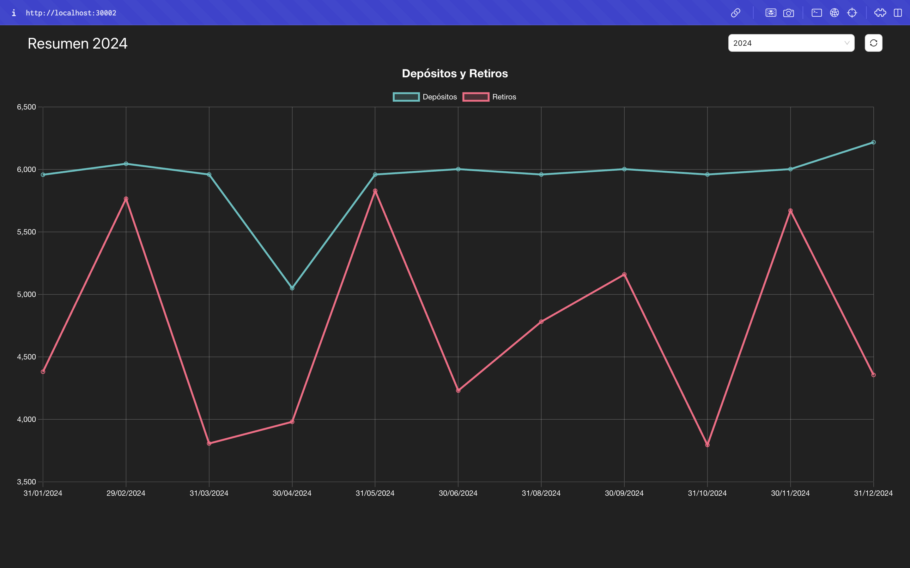

# groq-frontend-extract-pdf

[](LICENSE)  

>**Este proyecto es un frontend diseñado para mostrar un Dashboard de los ingresos y egresos anuales de los estados de cuenta de una persona.
Utilizamos Groq como herramienta de inteligencia artificial para procesar la información obtenida de archivos PDF.
Como parte de la infraestructura para manipular y almacenar la información, utilizamos Prisma como ORM y SQLite como motor de base de datos. El framework base del proyecto es React con Next.js 15, utilizando tanto el App Router como el Api Router para crear los servicios de GET y POST necesarios para el procesamiento de datos.**



## Tecnologías Utilizadas

- **Next.js 15**: Framework de React para aplicaciones web.
- **React-Query**: Librería para manejo de estado remoto.
- **Prisma**: ORM para interactuar con la base de datos.
- **SQLite**: Motor de base de datos ligero y embebido.
- **Ant Design**: Librería de componentes UI.
- **Chart.js**: Librería para gráficos.
- **Day.js**: Librería para manipulación de fechas.

## Estructura del proyecto

```
public/                
src/
├── adapters/
│   └── SummaryServiceAdapter.ts
├── app/
│   ├── api/
│   │   ├── pdf/
│   │   │   └── process/
│   │   │       └── route.ts
│   │   └── summary/
│   │       └── [year]/
│   │           └── route.ts
│   ├── layout.tsx
│   └── page.tsx
├── components/
│   └── Summary.tsx
├── infrastructure/
│   ├── database/
│   │   └── prisma.ts
│   └── logger/
│       └── logger.ts
├── services/
│   ├── factory.ts
│   ├── interfaces/
│   │   └── ISummaryService.ts
│   └── SummaryService.ts
├── types/
│   └── SummaryItem.ts
└── utils/
    └── logger.ts
```


## Requisitos Previos

- Node.js (versión 18 o superior)
- npm (versión 7 o superior) o yarn

## Instalación

1. Clona el repositorio:

    ```sh
    git clone https://github.com/dperezpro85/groq-frontend-extract-pdf.git
    cd groq-frontend-extract-pdf
    ```

2. Instala las dependencias:

    ```sh
    npm install
    # o
    yarn install
    ```

3. Genera el cliente de Prisma:

    ```sh
    npx prisma generate
    ```

4. Configura el archivo `.env` con la conexión a tu base de datos SQLite:

    ```env
    DATABASE_URL="file:./dev.db"

    GROQ_API_KEY=TU_API_KEY_DE_GROQ
    ```

5. Ejecuta las migraciones de Prisma para crear las tablas necesarias en la base de datos:

    ```sh
    npx prisma migrate dev --name init
    ```

## Ejecución en Desarrollo

Para levantar el ambiente de desarrollo, ejecuta:

```sh
npm run dev
# o
yarn dev


## License
Este proyecto está licenciado bajo la [Licencia MIT](LICENSE). Eres libre de usar y modificar este código para tus propios propósitos.  
